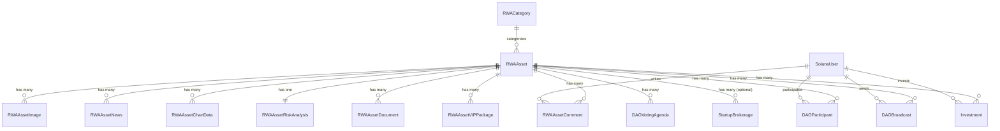

# RWA 투자 자산 데이터 구조 분석 문서

## 📋 목차
1. [메인 화면 데이터 구조](#1-메인-화면-데이터-구조-rwaassetdetailview)
2. [LV.1 FREE 티어 데이터](#2-lv1-free-티어-데이터)
3. [LV.2 BASIC 티어 데이터](#3-lv2-basic-티어-데이터)
4. [LV.3 STANDARD 티어 데이터](#4-lv3-standard-티어-데이터)
5. [LV.4 PREMIUM 티어 데이터](#5-lv4-premium-티어-데이터)
6. [LV.5 BUSINESS 티어 데이터](#6-lv5-business-티어-데이터)
7. [필요한 Django 모델 개선사항](#7-필요한-django-모델-개선사항)
8. [ERD 다이어그램](#8-erd-다이어그램)

---

## 1. 메인 화면 데이터 구조 (RWAAssetDetailView)

### 1.1 RWAAsset 기본 정보
```typescript
interface RWAAsset {
  id: string;                          // UUID
  name: string;                        // 자산명 (한글)
  name_en?: string;                    // 자산명 (영문)
  short_description: string;           // 짧은 설명 (한글)
  short_description_en?: string;       // 짧은 설명 (영문)
  description: string;                 // 상세 설명 (한글)
  description_en?: string;             // 상세 설명 (영문)

  // 투자 정보
  expected_apy: number;                // 예상 APY (18.5%)
  risk_level: string;                  // 위험도 (low/medium/high/very_high)
  risk_level_display: string;          // 위험도 표시명
  min_investment_glib: number;         // 최소 투자 금액 (GLIB)
  max_investment_glib?: number;        // 최대 투자 금액 (GLIB)
  investment_period_months: number;    // 투자 기간 (개월)

  // 자산 정보
  asset_location: string;              // 자산 위치 (한글)
  asset_location_en?: string;          // 자산 위치 (영문)
  asset_type: string;                  // 자산 유형 (부동산, 주식 등)
  asset_type_en?: string;              // 자산 유형 (영문)
  total_value_usd: number;             // 총 자산 가치 (USD)

  // 펀딩 정보
  total_invested_glib: number;         // 총 투자 금액
  funding_target_glib: number;         // 펀딩 목표 금액
  funding_progress: number;            // 펀딩 진행률 (%)
  investor_count: number;              // 투자자 수

  // 이미지
  images: RWAAssetImage[];             // 이미지 배열 (최대 10개 표시)

  // 상태
  status: string;                      // 상태 (draft/active/paused/completed/cancelled)
  is_featured: boolean;                // 추천 여부
  category_name: string;               // 카테고리명
}
```

### 1.2 RWAAssetImage 구조
```typescript
interface RWAAssetImage {
  id: string;                          // UUID
  asset: string;                       // 자산 ID
  image_url: string;                   // S3 이미지 URL
  order: number;                       // 정렬 순서
  is_primary: boolean;                 // 메인 이미지 여부
  alt_text: string;                    // 이미지 설명 (한글)
  alt_text_en: string;                 // 이미지 설명 (영문)
  created_at: string;
  updated_at: string;
}
```

### 1.3 Comment 구조 (신규 필요)
```typescript
interface RWAAssetComment {
  id: string;                          // UUID
  asset: string;                       // 자산 ID
  user: string;                        // 사용자 ID
  user_display_name: string;           // 표시 이름
  user_tier: string;                   // 사용자 등급 (free/basic/standard/premium/business)
  content: string;                     // 댓글 내용
  created_at: string;                  // 작성 시간
  updated_at: string;
  is_deleted: boolean;                 // 삭제 여부
  parent_comment?: string;             // 답글인 경우 부모 댓글 ID
}
```

### 1.4 Grade Thresholds (등급 체계)
```typescript
interface GradeThreshold {
  min: number;                         // 최소 GLIB 수량
  max: number;                         // 최대 GLIB 수량
  grade: string;                       // 등급 코드 (free/basic/standard/premium/business)
  name: string;                        // 등급명 (FREE/BASIC/STANDARD/PREMIUM/BUSINESS)
  apr: number;                         // 해당 등급 APR (%)
  description: string;                 // 등급 설명
  color: string;                       // 등급 색상
}

// 등급 데이터
const gradeThresholds = [
  { min: 0, max: 999, grade: "free", name: "FREE", apr: 0,
    description: "일반 포털 및 구글 검색을 통해 누구나 접근 가능한 공개 정보 제공",
    color: "#ffffff" },
  { min: 1000, max: 4999, grade: "basic", name: "BASIC", apr: 5,
    description: "AI 자동 분석을 통한 고정밀 정보 발췌 및 검색하기 어려운 심층 데이터 제공",
    color: "#4ade80" },
  { min: 5000, max: 9999, grade: "standard", name: "STANDARD", apr: 7,
    description: "글로벌 부동산 · 레저 그룹의 유료 재무제표 및 기업 내부 전문 정보 열람 권한",
    color: "#fbbf24" },
  { min: 10000, max: 99999, grade: "premium", name: "PREMIUM", apr: 10,
    description: "VIP 현장 임장 패키지 및 DAO 거버넌스 참여 권한",
    color: "#22d3ee" },
  { min: 100000, max: Infinity, grade: "business", name: "BUSINESS", apr: 15,
    description: "CEO 직접 연결 및 대규모 협상 개시 권한",
    color: "#c084fc" }
];
```

---

## 2. LV.1 FREE 티어 데이터

### 2.1 General Tourism Statistics (차트 데이터)
```typescript
interface TourismChartData {
  id: string;
  asset: string;                       // 자산 ID
  chart_type: string;                  // 'tourism_statistics'
  data_points: number[];               // 차트 데이터 포인트 (8개)
  labels: string[];                    // 라벨 (월/분기 등)
  created_at: string;
  updated_at: string;
}

// 예시 데이터
{
  data_points: [60, 75, 55, 85, 70, 90, 65, 80],
  labels: ["Q1", "Q2", "Q3", "Q4", "Q5", "Q6", "Q7", "Q8"]
}
```

### 2.2 Public Media & News (뉴스 데이터) - 신규 필요
```typescript
interface RWAAssetNews {
  id: string;                          // UUID
  asset: string;                       // 자산 ID
  tier_level: string;                  // 등급 (free/basic/standard/premium/business)
  title: string;                       // 뉴스 제목
  source: string;                      // 출처
  views: string;                       // 조회수 또는 업데이트 시간
  description: string;                 // 요약 설명
  thumbnail: string;                   // 썸네일 이미지 URL
  url?: string;                        // 원문 링크
  published_at: string;                // 발행일
  created_at: string;
  is_active: boolean;                  // 활성 여부
  order: number;                       // 정렬 순서
}

// 더미 데이터 예시
[
  {
    title: "Cambodia Tourism Growth 2025 Report",
    source: "Global Economics News",
    views: "24K views",
    description: "Analysis of massive casino complex development in Sihanoukville...",
    thumbnail: "https://images.unsplash.com/photo-1596838132731-3301c3fd4317?w=200"
  },
  {
    title: "Sihanoukville Investment Guide & Regulations",
    source: "Google Public Data",
    views: "Updated yesterday",
    description: "Summary of key tax incentives and foreign investment regulations...",
    thumbnail: "https://images.unsplash.com/photo-1605870445919-838d190e8e1b?w=200"
  }
]
```

### 2.3 Location/Map 데이터
- 기존 `RWAAsset.asset_location` 필드 사용
- 추가 필요: 위도/경도 정보

```typescript
// RWAAsset 모델에 추가 필요
latitude?: number;                     // 위도
longitude?: number;                    // 경도
map_embed_url?: string;                // 구글맵 임베드 URL
```

---

## 3. LV.2 BASIC 티어 데이터

### 3.1 AI Risk Analysis (리스크 분석) - 신규 필요
```typescript
interface RWAAssetRiskAnalysis {
  id: string;
  asset: string;                       // 자산 ID

  // 레이더 차트 데이터
  sentiment: string;                   // 'Positive' | 'Negative' | 'Neutral'
  volatility: string;                  // 'Low' | 'Moderate' | 'High'
  liquidity: string;                   // 'High' | 'Medium' | 'Low'
  overall_score: number;               // 0-10

  // 레이더 차트 상세 데이터 (5-7개 축)
  radar_data: {
    label: string;
    value: number;                     // 0-100
  }[];

  // AI 분석 날짜
  analyzed_at: string;
  created_at: string;
  updated_at: string;
}

// 더미 데이터 예시
{
  sentiment: "Positive",
  volatility: "Moderate",
  liquidity: "High",
  overall_score: 7.8,
  radar_data: [
    { label: "Market Risk", value: 65 },
    { label: "Credit Risk", value: 80 },
    { label: "Liquidity Risk", value: 90 },
    { label: "Operational Risk", value: 75 },
    { label: "Regulatory Risk", value: 70 }
  ]
}
```

### 3.2 AI News Summary (AI 요약 뉴스)
- 기존 `RWAAssetNews` 모델 확장 사용
- `tier_level = 'basic'` 필터링
- 추가 필드:

```typescript
// RWAAssetNews에 추가
ai_summary?: string;                   // AI 요약 텍스트
ai_confidence?: number;                // AI 신뢰도 (0-100)
sentiment_indicator?: string;          // 'positive' | 'warning' | 'negative'
```

// 더미 데이터 예시
```json
[
  {
    "title": "Cambodia tourism sector shows 15% YoY growth in Q4 2024",
    "ai_summary": "AI 요약: 캄보디아 관광 부문이 강력한 회복세를 보이며 카지노 및 리조트 투자에 긍정적 영향",
    "source": "Bloomberg SEA",
    "views": "2시간 전",
    "ai_confidence": 92,
    "sentiment_indicator": "positive"
  },
  {
    "title": "Regional regulatory changes may impact gaming operations",
    "ai_summary": "AI 요약: 동남아 일부 국가의 규제 변화 가능성 모니터링 필요, 단기 변동성 예상",
    "source": "Financial Times",
    "views": "1일 전",
    "ai_confidence": 85,
    "sentiment_indicator": "warning"
  }
]
```

---

## 4. LV.3 STANDARD 티어 데이터

### 4.1 Private Data Room (프라이빗 데이터룸) - 신규 필요
```typescript
interface RWAAssetDocument {
  id: string;                          // UUID
  asset: string;                       // 자산 ID
  tier_level: string;                  // 'standard' | 'premium' | 'business'

  // 문서 정보
  file_name: string;                   // 파일명
  file_type: string;                   // 'pdf' | 'excel' | 'word' | 'image'
  file_url: string;                    // S3 파일 URL
  file_size: number;                   // 파일 크기 (bytes)

  // 문서 메타데이터
  document_type: string;               // 'audit_report' | 'financial_statement' | 'legal_doc' | 'other'
  title: string;                       // 문서 제목
  description: string;                 // 문서 설명

  // 권한 및 상태
  requires_nda: boolean;               // NDA 필요 여부
  is_confidential: boolean;            // 기밀 문서 여부
  order: number;                       // 정렬 순서
  is_active: boolean;                  // 활성 여부

  created_at: string;
  updated_at: string;
}

// 더미 데이터 예시
[
  {
    "file_name": "FY2024_Internal_Audit_Report_Final.pdf",
    "title": "FY2024 Internal Audit Report (Final)",
    "file_type": "pdf",
    "document_type": "audit_report",
    "is_confidential": true
  },
  {
    "file_name": "Q4_2024_Revenue_Breakdown.xlsx",
    "title": "Q4 2024 Revenue Breakdown (Excel)",
    "file_type": "excel",
    "document_type": "financial_statement",
    "is_confidential": true
  },
  {
    "file_name": "Operator_Agreement_Partnership_Terms.pdf",
    "title": "Operator Agreement & Partnership Terms",
    "file_type": "pdf",
    "document_type": "legal_doc",
    "is_confidential": true
  },
  {
    "file_name": "Legal_Risk_Assessment_Compliance_Report.pdf",
    "title": "Legal Risk Assessment & Compliance Report",
    "file_type": "pdf",
    "document_type": "legal_doc",
    "is_confidential": true
  },
  {
    "file_name": "Environmental_Audit_Sustainability_Report.pdf",
    "title": "Environmental Audit & Sustainability Report",
    "file_type": "pdf",
    "document_type": "other",
    "is_confidential": true
  }
]
```

---

## 5. LV.4 PREMIUM 티어 데이터

### 5.1 VIP Field Trip Packages (VIP 현장 임장 패키지) - 신규 필요
```typescript
interface RWAAssetVIPPackage {
  id: string;                          // UUID
  asset: string;                       // 자산 ID

  // 패키지 정보
  title: string;                       // 패키지 제목
  description: string;                 // 패키지 설명
  location: string;                    // 장소
  duration_days: number;               // 기간 (일)

  // 가격 정보
  price_glib: number;                  // GLIB 가격
  price_usd: number;                   // USD 가격 (표시용)

  // 포함 사항
  includes: string[];                  // 포함 내용 리스트

  // 이미지
  image_url: string;                   // 패키지 이미지 URL

  // 상태
  is_available: boolean;               // 예약 가능 여부
  max_participants: number;            // 최대 참가 인원
  order: number;                       // 정렬 순서

  created_at: string;
  updated_at: string;
}

// 더미 데이터 예시
[
  {
    "title": "3박 4일 시아누크빌 프라이빗 투어 (캄보디아)",
    "description": "차량/통역 포함, 5성급 호텔 제공",
    "location": "시아누크빌, 캄보디아",
    "duration_days": 4,
    "price_glib": 1500,
    "price_usd": 2000,
    "includes": ["5성급 호텔", "전용 차량", "통역", "VIP 라운지"],
    "image_url": "https://images.unsplash.com/photo-1596838132731-3301c3fd4317?w=200"
  },
  {
    "title": "5박 6일 마닐라 럭셔리 리조트 투어 (필리핀)",
    "description": "전용 가이드, VIP 라운지 이용 포함",
    "location": "마닐라, 필리핀",
    "duration_days": 6,
    "price_glib": 2200,
    "price_usd": 3000,
    "includes": ["럭셔리 리조트", "전용 가이드", "VIP 라운지", "스파 서비스"],
    "image_url": "https://images.unsplash.com/photo-1605870445919-838d190e8e1b?w=200"
  },
  {
    "title": "4박 5일 다낭 골프 리조트 투어 (베트남)",
    "description": "골프장 라운딩, 스파 서비스 포함",
    "location": "다낭, 베트남",
    "duration_days": 5,
    "price_glib": 1800,
    "price_usd": 2500,
    "includes": ["골프 리조트", "골프장 라운딩", "스파 서비스", "전용 차량"],
    "image_url": "https://images.unsplash.com/photo-1528127269322-539801943592?w=200"
  }
]
```

### 5.2 DAO Governance (DAO 거버넌스) - 신규 필요

#### 5.2.1 공지사항/브로드캐스트
```typescript
interface DAOBroadcast {
  id: string;
  asset: string;                       // 자산 ID
  sender: string;                      // 발신자 ID
  message: string;                     // 공지 내용
  target_tier: string;                 // 대상 등급 (bronze+, premium+ 등)
  created_at: string;
}
```

#### 5.2.2 투표 안건
```typescript
interface DAOVotingAgenda {
  id: string;                          // UUID
  asset: string;                       // 자산 ID

  // 안건 정보
  title: string;                       // 안건 제목
  description: string;                 // 안건 설명
  agenda_type: string;                 // 'dividend' | 'strategy' | 'operation' | 'other'

  // 투표 기간
  start_date: string;
  end_date: string;

  // 투표 결과
  total_votes: number;                 // 총 투표 수
  approve_votes: number;               // 찬성 투표 수
  reject_votes: number;                // 반대 투표 수
  approve_percentage: number;          // 찬성 비율 (%)
  reject_percentage: number;           // 반대 비율 (%)

  // 상태
  status: string;                      // 'active' | 'completed' | 'cancelled'

  created_at: string;
  updated_at: string;
}

// 더미 데이터 예시
{
  "title": "2025 Q1 배당금 재투자 vs 현금 지급",
  "description": "Q1 배당금을 재투자할지 현금으로 지급할지 결정",
  "end_date": "2025-02-08T14:00:00Z",
  "total_votes": 1000,
  "approve_votes": 650,
  "reject_votes": 350,
  "approve_percentage": 65,
  "reject_percentage": 35,
  "status": "active"
}
```

#### 5.2.3 거버넌스 참여자
```typescript
interface DAOParticipant {
  id: string;
  asset: string;                       // 자산 ID
  user: string;                        // 사용자 ID
  user_display_name: string;           // 표시 이름
  tier: string;                        // 등급

  // 참여 정보
  staked_amount: number;               // 스테이킹 수량 (GLIB)
  voting_power_percentage: number;     // 투표 파워 (%)
  total_votes_participated: number;    // 참여한 투표 수

  // 순위
  rank: number;                        // 순위

  created_at: string;
  updated_at: string;
}

// 더미 데이터 예시
[
  {
    "rank": 1,
    "user_display_name": "WHALE_VVIP_01",
    "tier": "BUSINESS ACCESS",
    "staked_amount": 1240000,
    "voting_power_percentage": 29.7
  },
  {
    "rank": 2,
    "user_display_name": "ALPHA_STAKER",
    "tier": "PREMIUM ACCESS",
    "staked_amount": 850000,
    "voting_power_percentage": 20.2
  },
  {
    "rank": 3,
    "user_display_name": "DIAMOND_INVESTOR",
    "tier": "PREMIUM ACCESS",
    "staked_amount": 620000,
    "voting_power_percentage": 14.8
  }
]
```

#### 5.2.4 거버넌스 상태
```typescript
interface DAOGovernanceStatus {
  id: string;
  asset: string;                       // 자산 ID

  // 전체 스테이킹 정보
  total_staked_glib: number;           // 총 스테이킹 수량
  governance_status: string;           // 'Active' | 'Inactive'
  quorum_status: string;               // 'Reached' | 'Not Reached'
  quorum_requirement: number;          // 정족수 요구사항 (GLIB)

  // 통계
  total_participants: number;          // 총 참여자 수
  active_agendas: number;              // 진행 중인 안건 수

  updated_at: string;
}

// 더미 데이터 예시
{
  "total_staked_glib": 4200000,
  "governance_status": "Active",
  "quorum_status": "Reached",
  "quorum_requirement": 2000000,
  "total_participants": 247,
  "active_agendas": 1
}
```

---

## 6. LV.5 BUSINESS 티어 데이터

### 6.1 GLI Equity Desk (에퀴티 데스크) - 메타데이터로 관리
```typescript
// RWAAsset.metadata에 저장
{
  "equity_desk": {
    "enabled": true,
    "ceo_name": "John Smith",
    "ceo_title": "CEO, Global Leisure Industries",
    "contact_email": "ceo@gli.com",
    "meeting_availability": true,
    "negotiation_min_amount": 100000000  // 최소 협상 금액 (GLIB)
  }
}
```

### 6.2 Startup Brokerage (스타트업 지분 브로커리지) - 신규 필요
```typescript
interface StartupBrokerage {
  id: string;                          // UUID
  asset?: string;                      // 자산 ID (null이면 전체 공통)

  // 스타트업 정보
  startup_name: string;                // 스타트업 이름
  category: string;                    // 카테고리
  description: string;                 // 설명

  // 투자 정보
  investment_stage: string;            // 'seed' | 'series_a' | 'series_b' | 'series_c'
  target_amount_usd: number;           // 목표 투자액 (USD)
  current_valuation_usd: number;       // 현재 밸류에이션 (USD)

  // 연락처
  ir_contact_email: string;            // IR 담당자 이메일
  ir_contact_name: string;             // IR 담당자 이름

  // 문서
  ir_deck_url?: string;                // IR 자료 URL
  business_plan_url?: string;          // 사업 계획서 URL

  // 상태
  is_available: boolean;               // IR 연결 가능 여부
  order: number;                       // 정렬 순서

  created_at: string;
  updated_at: string;
}

// 더미 데이터 예시
[
  {
    "startup_name": "BlockChain Payment Gateway Inc.",
    "category": "글로벌 결제 인프라",
    "description": "블록체인 기반 글로벌 결제 솔루션",
    "investment_stage": "series_b",
    "target_amount_usd": 50000000,
    "current_valuation_usd": 200000000,
    "ir_contact_name": "김철수"
  },
  {
    "startup_name": "AI Trading Algorithm Platform",
    "category": "핀테크 AI 솔루션",
    "description": "AI 기반 자동 트레이딩 플랫폼",
    "investment_stage": "series_a",
    "target_amount_usd": 20000000,
    "current_valuation_usd": 80000000,
    "ir_contact_name": "이영희"
  },
  {
    "startup_name": "Metaverse Real Estate DAO",
    "category": "가상 부동산 플랫폼",
    "description": "메타버스 부동산 투자 플랫폼",
    "investment_stage": "seed",
    "target_amount_usd": 10000000,
    "current_valuation_usd": 30000000,
    "ir_contact_name": "박민수"
  },
  {
    "startup_name": "Cross-Border Remittance Network",
    "category": "국경간 송금 서비스",
    "description": "저비용 국제 송금 네트워크",
    "investment_stage": "series_a",
    "target_amount_usd": 15000000,
    "current_valuation_usd": 60000000,
    "ir_contact_name": "최지은"
  }
]
```

---

## 7. 필요한 Django 모델 개선사항

### 7.1 기존 모델 수정 (RWAAsset)
```python
class RWAAsset(BaseTimestampModel):
    # ... 기존 필드 유지 ...

    # 🆕 추가 필요 필드
    # 위치 정보 (지도)
    latitude = models.DecimalField(max_digits=9, decimal_places=6, null=True, blank=True, verbose_name='위도')
    longitude = models.DecimalField(max_digits=9, decimal_places=6, null=True, blank=True, verbose_name='경도')
    map_embed_url = models.URLField(blank=True, verbose_name='지도 임베드 URL')

    # 펀딩 마감일
    funding_deadline = models.DateTimeField(null=True, blank=True, verbose_name='펀딩 마감일')
```

### 7.2 신규 모델 생성

#### 1) RWAAssetComment (댓글)
```python
class RWAAssetComment(BaseTimestampModel):
    """RWA 자산 댓글 모델"""
    id = models.UUIDField(primary_key=True, default=uuid.uuid4, editable=False)
    asset = models.ForeignKey(RWAAsset, on_delete=models.CASCADE, related_name='comments')
    user = models.ForeignKey(SolanaUser, on_delete=models.CASCADE, related_name='rwa_comments')
    parent_comment = models.ForeignKey('self', null=True, blank=True, on_delete=models.CASCADE, related_name='replies')

    content = models.TextField(verbose_name='댓글 내용')
    is_deleted = models.BooleanField(default=False, verbose_name='삭제 여부')

    class Meta:
        db_table = 'rwa_asset_comments'
        ordering = ['-created_at']
        indexes = [
            models.Index(fields=['asset', '-created_at']),
            models.Index(fields=['user', '-created_at']),
        ]
```

#### 2) RWAAssetNews (뉴스)
```python
class RWAAssetNews(BaseTimestampModel):
    """RWA 자산 관련 뉴스 모델"""
    id = models.UUIDField(primary_key=True, default=uuid.uuid4, editable=False)
    asset = models.ForeignKey(RWAAsset, on_delete=models.CASCADE, related_name='news')

    # 뉴스 정보
    tier_level = models.CharField(max_length=20, choices=[
        ('free', 'FREE'),
        ('basic', 'BASIC'),
        ('standard', 'STANDARD'),
        ('premium', 'PREMIUM'),
        ('business', 'BUSINESS'),
    ], default='free', db_index=True, verbose_name='등급')

    title = models.CharField(max_length=500, verbose_name='제목')
    source = models.CharField(max_length=200, verbose_name='출처')
    description = models.TextField(verbose_name='설명')
    thumbnail = models.URLField(verbose_name='썸네일 URL')
    url = models.URLField(blank=True, verbose_name='원문 링크')

    # AI 관련 (BASIC 등급용)
    ai_summary = models.TextField(blank=True, verbose_name='AI 요약')
    ai_confidence = models.IntegerField(null=True, blank=True, validators=[MinValueValidator(0), MaxValueValidator(100)], verbose_name='AI 신뢰도')
    sentiment_indicator = models.CharField(max_length=20, choices=[
        ('positive', '긍정'),
        ('neutral', '중립'),
        ('warning', '경고'),
        ('negative', '부정'),
    ], default='neutral', blank=True, verbose_name='감정 지표')

    # 통계
    views_text = models.CharField(max_length=100, verbose_name='조회수 텍스트')  # "24K views", "2시간 전"
    published_at = models.DateTimeField(verbose_name='발행일')

    # 상태
    is_active = models.BooleanField(default=True, db_index=True)
    order = models.PositiveIntegerField(default=0, db_index=True)

    class Meta:
        db_table = 'rwa_asset_news'
        ordering = ['asset', 'tier_level', 'order', '-published_at']
        indexes = [
            models.Index(fields=['asset', 'tier_level', 'is_active']),
            models.Index(fields=['published_at']),
        ]
```

#### 3) RWAAssetChartData (차트 데이터)
```python
class RWAAssetChartData(BaseTimestampModel):
    """RWA 자산 차트 데이터 모델"""
    id = models.UUIDField(primary_key=True, default=uuid.uuid4, editable=False)
    asset = models.ForeignKey(RWAAsset, on_delete=models.CASCADE, related_name='chart_data')

    chart_type = models.CharField(max_length=50, verbose_name='차트 유형')  # 'tourism_statistics', 'revenue', etc
    data_points = models.JSONField(default=list, verbose_name='데이터 포인트')  # [60, 75, 55, 85, ...]
    labels = models.JSONField(default=list, verbose_name='라벨')  # ["Q1", "Q2", ...]
    chart_config = models.JSONField(default=dict, blank=True, verbose_name='차트 설정')

    class Meta:
        db_table = 'rwa_asset_chart_data'
        ordering = ['asset', 'chart_type']
```

#### 4) RWAAssetRiskAnalysis (리스크 분석)
```python
class RWAAssetRiskAnalysis(BaseTimestampModel):
    """RWA 자산 AI 리스크 분석 모델 (BASIC 등급용)"""
    id = models.UUIDField(primary_key=True, default=uuid.uuid4, editable=False)
    asset = models.OneToOneField(RWAAsset, on_delete=models.CASCADE, related_name='risk_analysis')

    # 메트릭
    sentiment = models.CharField(max_length=20, choices=[
        ('positive', 'Positive'),
        ('neutral', 'Neutral'),
        ('negative', 'Negative'),
    ], default='neutral', verbose_name='감정')

    volatility = models.CharField(max_length=20, choices=[
        ('low', 'Low'),
        ('moderate', 'Moderate'),
        ('high', 'High'),
    ], default='moderate', verbose_name='변동성')

    liquidity = models.CharField(max_length=20, choices=[
        ('high', 'High'),
        ('medium', 'Medium'),
        ('low', 'Low'),
    ], default='medium', verbose_name='유동성')

    overall_score = models.DecimalField(max_digits=3, decimal_places=1, validators=[MinValueValidator(0), MaxValueValidator(10)], verbose_name='종합 점수')

    # 레이더 차트 데이터
    radar_data = models.JSONField(default=list, verbose_name='레이더 차트 데이터')
    # [{"label": "Market Risk", "value": 65}, {"label": "Credit Risk", "value": 80}, ...]

    analyzed_at = models.DateTimeField(auto_now=True, verbose_name='분석 날짜')

    class Meta:
        db_table = 'rwa_asset_risk_analysis'
```

#### 5) RWAAssetDocument (문서/파일)
```python
class RWAAssetDocument(BaseTimestampModel):
    """RWA 자산 문서/파일 모델 (STANDARD 등급용)"""
    id = models.UUIDField(primary_key=True, default=uuid.uuid4, editable=False)
    asset = models.ForeignKey(RWAAsset, on_delete=models.CASCADE, related_name='documents')

    # 등급
    tier_level = models.CharField(max_length=20, choices=[
        ('standard', 'STANDARD'),
        ('premium', 'PREMIUM'),
        ('business', 'BUSINESS'),
    ], default='standard', db_index=True, verbose_name='등급')

    # 파일 정보
    file_name = models.CharField(max_length=255, verbose_name='파일명')
    file_type = models.CharField(max_length=20, choices=[
        ('pdf', 'PDF'),
        ('excel', 'Excel'),
        ('word', 'Word'),
        ('image', 'Image'),
    ], verbose_name='파일 유형')
    file_url = models.URLField(verbose_name='파일 URL')
    file_size = models.BigIntegerField(verbose_name='파일 크기 (bytes)')

    # 문서 메타데이터
    document_type = models.CharField(max_length=50, choices=[
        ('audit_report', '감사 보고서'),
        ('financial_statement', '재무제표'),
        ('legal_doc', '법률 문서'),
        ('environmental', '환경 보고서'),
        ('other', '기타'),
    ], default='other', verbose_name='문서 유형')

    title = models.CharField(max_length=300, verbose_name='문서 제목')
    description = models.TextField(blank=True, verbose_name='문서 설명')

    # 권한
    requires_nda = models.BooleanField(default=False, verbose_name='NDA 필요 여부')
    is_confidential = models.BooleanField(default=True, verbose_name='기밀 문서 여부')

    # 상태
    is_active = models.BooleanField(default=True, db_index=True)
    order = models.PositiveIntegerField(default=0, db_index=True)

    class Meta:
        db_table = 'rwa_asset_documents'
        ordering = ['asset', 'tier_level', 'order']
        indexes = [
            models.Index(fields=['asset', 'tier_level', 'is_active']),
        ]
```

#### 6) RWAAssetVIPPackage (VIP 패키지)
```python
class RWAAssetVIPPackage(BaseTimestampModel):
    """RWA 자산 VIP 현장 임장 패키지 모델 (PREMIUM 등급용)"""
    id = models.UUIDField(primary_key=True, default=uuid.uuid4, editable=False)
    asset = models.ForeignKey(RWAAsset, on_delete=models.CASCADE, related_name='vip_packages')

    # 패키지 정보
    title = models.CharField(max_length=300, verbose_name='패키지 제목')
    description = models.TextField(verbose_name='패키지 설명')
    location = models.CharField(max_length=200, verbose_name='장소')
    duration_days = models.PositiveIntegerField(verbose_name='기간(일)')

    # 가격
    price_glib = models.DecimalField(max_digits=20, decimal_places=8, verbose_name='가격(GLIB)')
    price_usd = models.DecimalField(max_digits=10, decimal_places=2, verbose_name='가격(USD)')

    # 포함 사항
    includes = models.JSONField(default=list, verbose_name='포함 내용')  # ["5성급 호텔", "전용 차량", ...]

    # 이미지
    image_url = models.URLField(verbose_name='패키지 이미지 URL')

    # 예약 정보
    is_available = models.BooleanField(default=True, verbose_name='예약 가능 여부')
    max_participants = models.PositiveIntegerField(default=10, verbose_name='최대 참가 인원')
    current_bookings = models.PositiveIntegerField(default=0, verbose_name='현재 예약 수')

    # 정렬
    order = models.PositiveIntegerField(default=0, db_index=True)

    class Meta:
        db_table = 'rwa_asset_vip_packages'
        ordering = ['asset', 'order']
```

#### 7) DAOVotingAgenda (DAO 투표 안건)
```python
class DAOVotingAgenda(BaseTimestampModel):
    """DAO 투표 안건 모델 (PREMIUM 등급용)"""
    id = models.UUIDField(primary_key=True, default=uuid.uuid4, editable=False)
    asset = models.ForeignKey(RWAAsset, on_delete=models.CASCADE, related_name='dao_agendas')

    # 안건 정보
    title = models.CharField(max_length=500, verbose_name='안건 제목')
    description = models.TextField(verbose_name='안건 설명')
    agenda_type = models.CharField(max_length=50, choices=[
        ('dividend', '배당금'),
        ('strategy', '전략'),
        ('operation', '운영'),
        ('other', '기타'),
    ], default='other', verbose_name='안건 유형')

    # 투표 기간
    start_date = models.DateTimeField(verbose_name='시작일')
    end_date = models.DateTimeField(verbose_name='종료일')

    # 투표 결과
    total_votes = models.PositiveIntegerField(default=0, verbose_name='총 투표 수')
    approve_votes = models.PositiveIntegerField(default=0, verbose_name='찬성 투표 수')
    reject_votes = models.PositiveIntegerField(default=0, verbose_name='반대 투표 수')

    # 상태
    status = models.CharField(max_length=20, choices=[
        ('active', '진행 중'),
        ('completed', '완료'),
        ('cancelled', '취소'),
    ], default='active', db_index=True, verbose_name='상태')

    class Meta:
        db_table = 'dao_voting_agendas'
        ordering = ['asset', '-start_date']
        indexes = [
            models.Index(fields=['asset', 'status']),
            models.Index(fields=['-start_date']),
        ]

    @property
    def approve_percentage(self):
        if self.total_votes == 0:
            return 0
        return round((self.approve_votes / self.total_votes) * 100, 1)

    @property
    def reject_percentage(self):
        if self.total_votes == 0:
            return 0
        return round((self.reject_votes / self.total_votes) * 100, 1)
```

#### 8) DAOParticipant (DAO 참여자)
```python
class DAOParticipant(BaseTimestampModel):
    """DAO 거버넌스 참여자 모델"""
    id = models.UUIDField(primary_key=True, default=uuid.uuid4, editable=False)
    asset = models.ForeignKey(RWAAsset, on_delete=models.CASCADE, related_name='dao_participants')
    user = models.ForeignKey(SolanaUser, on_delete=models.CASCADE, related_name='dao_participations')

    # 스테이킹 정보
    staked_amount = models.DecimalField(max_digits=20, decimal_places=8, verbose_name='스테이킹 수량(GLIB)')

    # 참여 통계
    total_votes_participated = models.PositiveIntegerField(default=0, verbose_name='참여한 투표 수')
    last_vote_date = models.DateTimeField(null=True, blank=True, verbose_name='마지막 투표 날짜')

    class Meta:
        db_table = 'dao_participants'
        unique_together = ['asset', 'user']
        ordering = ['asset', '-staked_amount']
        indexes = [
            models.Index(fields=['asset', '-staked_amount']),
        ]

    @property
    def voting_power_percentage(self):
        # 전체 스테이킹 대비 비율 계산
        total_staked = DAOParticipant.objects.filter(asset=self.asset).aggregate(
            total=models.Sum('staked_amount')
        )['total'] or 0

        if total_staked == 0:
            return 0
        return round((float(self.staked_amount) / float(total_staked)) * 100, 1)
```

#### 9) DAOBroadcast (DAO 공지사항)
```python
class DAOBroadcast(BaseTimestampModel):
    """DAO 공지사항/브로드캐스트 모델"""
    id = models.UUIDField(primary_key=True, default=uuid.uuid4, editable=False)
    asset = models.ForeignKey(RWAAsset, on_delete=models.CASCADE, related_name='dao_broadcasts')
    sender = models.ForeignKey(SolanaUser, on_delete=models.CASCADE, related_name='sent_broadcasts')

    message = models.TextField(verbose_name='공지 내용')
    target_tier = models.CharField(max_length=50, default='bronze+', verbose_name='대상 등급')

    class Meta:
        db_table = 'dao_broadcasts'
        ordering = ['asset', '-created_at']
```

#### 10) StartupBrokerage (스타트업 브로커리지)
```python
class StartupBrokerage(BaseTimestampModel):
    """스타트업 지분 브로커리지 모델 (BUSINESS 등급용)"""
    id = models.UUIDField(primary_key=True, default=uuid.uuid4, editable=False)
    asset = models.ForeignKey(RWAAsset, null=True, blank=True, on_delete=models.CASCADE, related_name='startup_brokerages')

    # 스타트업 정보
    startup_name = models.CharField(max_length=200, verbose_name='스타트업 이름')
    category = models.CharField(max_length=100, verbose_name='카테고리')
    description = models.TextField(verbose_name='설명')

    # 투자 정보
    investment_stage = models.CharField(max_length=20, choices=[
        ('seed', 'Seed'),
        ('series_a', 'Series A'),
        ('series_b', 'Series B'),
        ('series_c', 'Series C'),
        ('series_d+', 'Series D+'),
    ], default='seed', verbose_name='투자 단계')

    target_amount_usd = models.DecimalField(max_digits=15, decimal_places=2, verbose_name='목표 투자액(USD)')
    current_valuation_usd = models.DecimalField(max_digits=15, decimal_places=2, verbose_name='현재 밸류에이션(USD)')

    # IR 연락처
    ir_contact_name = models.CharField(max_length=100, verbose_name='IR 담당자 이름')
    ir_contact_email = models.EmailField(verbose_name='IR 담당자 이메일')
    ir_contact_phone = models.CharField(max_length=50, blank=True, verbose_name='IR 담당자 전화')

    # 문서
    ir_deck_url = models.URLField(blank=True, verbose_name='IR 자료 URL')
    business_plan_url = models.URLField(blank=True, verbose_name='사업 계획서 URL')

    # 상태
    is_available = models.BooleanField(default=True, verbose_name='IR 연결 가능 여부')
    order = models.PositiveIntegerField(default=0, db_index=True)

    class Meta:
        db_table = 'startup_brokerages'
        ordering = ['order', 'startup_name']
```

---

## 8. ERD 다이어그램



---

## 9. 요약 및 다음 단계

### 필요한 신규 모델 (10개)
1. ✅ RWAAssetComment - 댓글
2. ✅ RWAAssetNews - 뉴스 (FREE, BASIC)
3. ✅ RWAAssetChartData - 차트 데이터 (FREE)
4. ✅ RWAAssetRiskAnalysis - AI 리스크 분석 (BASIC)
5. ✅ RWAAssetDocument - 문서/파일 (STANDARD)
6. ✅ RWAAssetVIPPackage - VIP 패키지 (PREMIUM)
7. ✅ DAOVotingAgenda - DAO 투표 안건 (PREMIUM)
8. ✅ DAOParticipant - DAO 참여자 (PREMIUM)
9. ✅ DAOBroadcast - DAO 공지사항 (PREMIUM)
10. ✅ StartupBrokerage - 스타트업 브로커리지 (BUSINESS)

### 기존 모델 수정
- ✅ RWAAsset: latitude, longitude, map_embed_url, funding_deadline 필드 추가

### Step 2 작업 내용
1. Django 모델 파일 수정 (apps/gli_content/models.py)
2. Migration 파일 생성 및 적용
3. Admin 페이지 설정
4. Serializer 작성
5. API 엔드포인트 구현

### Step 3 작업 내용
1. 더미 데이터 JSON 파일 준비
2. S3 이미지 업로드 스크립트 작성
3. DB 삽입 스크립트 (manage.py command) 작성
4. 데이터 검증

### Step 4 작업 내용
1. 관리자 화면 분석 (http://localhost:3001/rwa/assets)
2. 새로운 필드들을 포함한 폼 UI 재개발
3. 파일 업로드 기능 추가
4. Tier별 콘텐츠 관리 UI 개발

---

**작성일**: 2026-02-06
**작성자**: Claude Code
**문서 버전**: 1.0
